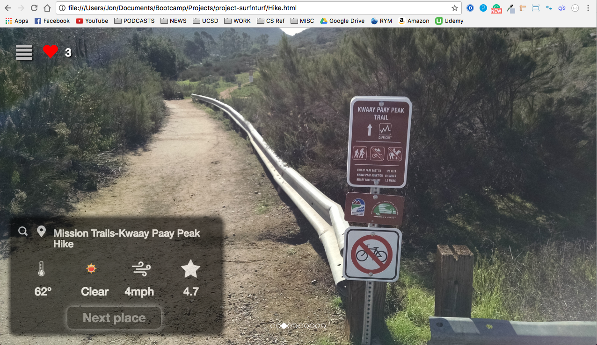

# Surf N' Turf

Surf N' Turf is a web application that allows users to search for nearby hiking and surfing spots while providing them with relevant information such as weather, rating, images, and map location as well as the option to save their favorite places.
## Team
Jon Lee  
Melissa Nguyen  
Sean Naylor  
Tony Afacchini
## APIs
Google Places - Used to get hiking locations, their photos, and ratings.  
OpenWeatherMap - Used to get the temperature, weather, and wind for both the hiking and surfing spots.  
Spitcast API - Used to get the surfing specific information such as tides.  
## Other Technologies
SASS - CSS preprocessor used to style our frontend.  
Firebase - Used to store the amount of favorites a location has received from users  
Local storage - Used to store a user's favorite locations.
## Installation
We currently do not have the website running on a server, but you can run the web app by downloading the repo to your local machine and opening the index.html file in your browser.
## Screenshots
  
